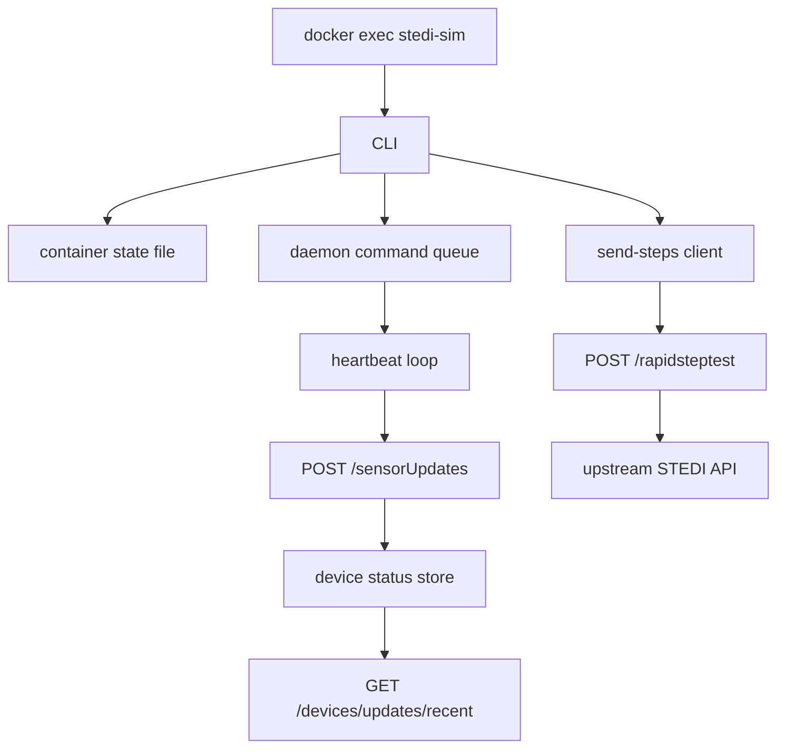

# STEDI Device Emulator Design

**Spec**: `.specs/features/stedi-device-emulator/spec.md` **Status**: Draft

---

## Architecture Overview

The feature has two slices. The app slice exposes stable development endpoints: `POST /rapidsteptest` forwards upstream, while `POST /sensorUpdates` and `GET /devices/updates/recent` manage emulator
heartbeat state locally. The emulator slice runs one Node daemon per container plus a CLI that updates container-local state and tells the daemon when to send heartbeats or rapid-step submissions.



---

## Code Reuse Analysis

### Existing Components to Leverage

| Component           | Location                             | How to Use                                             |
| ------------------- | ------------------------------------ | ------------------------------------------------------ |
| Pass-through helper | `src/utils/pass-through.ts`          | Reuse for `rapidsteptest` upstream forwarding behavior |
| KV fallback utility | `src/utils/kv-store.ts`              | Persist recent heartbeat timestamps with dev fallback  |
| Vitest route tests  | `src/__tests__/regression/*.test.ts` | Mirror existing mocking and request-construction style |

### Integration Points

| System                  | Integration Method                                              |
| ----------------------- | --------------------------------------------------------------- |
| Deployed app            | Emulator posts heartbeats and step tests to app routes          |
| STEDI upstream API      | App forwards `rapidsteptest` using existing pass-through helper |
| KV / in-memory fallback | App records recent heartbeats keyed by device ID                |

---

## Components

### App rapid-step forwarding route

- **Purpose**: Forward rapid step test requests upstream instead of storing them locally.
- **Location**: `src/app/rapidsteptest/route.ts`
- **Interfaces**:
    - `POST(request: Request): Promise<Response>`
- **Dependencies**: `forwardRequest`
- **Reuses**: Existing route pattern in `src/app/customer/route.ts`

### Device status store

- **Purpose**: Save and read recent heartbeat activity keyed by device ID.
- **Location**: `src/utils/device-status-store.ts`
- **Interfaces**:
    - `recordHeartbeat(input): Promise<void>`
    - `getRecentDevices(seconds: number): Promise<DeviceHeartbeat[]>`
- **Dependencies**: `kvGet`, `kvSet`
- **Reuses**: Existing KV fallback pattern in `src/utils/kv-store.ts`

### Heartbeat routes

- **Purpose**: Accept emulator heartbeats and serve recent device activity.
- **Location**: `src/app/sensorUpdates/route.ts`, `src/app/devices/updates/recent/route.ts`
- **Interfaces**:
    - `POST(request: Request): Promise<Response>`
    - `GET(request: Request): Promise<Response>`
- **Dependencies**: Device status store
- **Reuses**: Existing route-handler testing patterns

### Emulator payload generator

- **Purpose**: Produce randomized `rapidsteptest` payloads from the seed fixture.
- **Location**: `emulator/src/rapid-step-payload.js`
- **Interfaces**:
    - `buildRapidStepPayload(config, now?)`
- **Dependencies**: None beyond Node standard library
- **Reuses**: Seed payload supplied by the user

### Emulator state and daemon

- **Purpose**: Persist per-container configuration and maintain exactly one heartbeat loop.
- **Location**: `emulator/src/state.js`, `emulator/src/daemon.js`
- **Interfaces**:
    - `readState()` / `writeState(nextState)`
    - `startDaemon()` / control message handlers
- **Dependencies**: Node filesystem and timers
- **Reuses**: None; keep implementation flat and local

### Emulator CLI and HTTP client

- **Purpose**: Expose `stedi-sim` commands and send HTTP requests to the app.
- **Location**: `emulator/src/cli.js`, `emulator/src/client.js`
- **Interfaces**:
    - `main(argv)`
    - `sendHeartbeat(state)`
    - `sendRapidStepTest(state)`
- **Dependencies**: State module, payload generator, daemon control, fetch
- **Reuses**: None; simple command parsing only

---

## Data Models

### DeviceHeartbeat

```ts
interface DeviceHeartbeat {
    deviceId: string;
    customer: string | null;
    poweredOn: boolean;
    lastSeenAt: number;
}
```

**Relationships**: Stored by device ID in KV/in-memory fallback and surfaced through recent-device queries.

### EmulatorState

```ts
interface EmulatorState {
    deviceId: string | null;
    customer: string | null;
    sessionToken: string | null;
    targetBaseUrl: string;
    powerState: "on" | "off";
    heartbeatIntervalMs: number;
    daemonPid: number | null;
}
```

**Relationships**: Stored per container in a local JSON state file.

---

## Error Handling Strategy

| Error Scenario                                 | Handling                                                         | User Impact                            |
| ---------------------------------------------- | ---------------------------------------------------------------- | -------------------------------------- |
| Missing emulator config for `send-steps`       | CLI returns non-zero with a clear message listing missing fields | Developer fixes config before retrying |
| Repeated `on` command                          | Daemon keeps a single heartbeat loop active                      | Safe idempotent behavior               |
| Invalid `seconds` query on recent-device route | Route falls back to default window                               | Web consumers still get stable results |
| Upstream `rapidsteptest` failure               | CLI prints status/body and exits non-zero                        | Developer sees exact upstream failure  |

---

## Risks & Concerns

| Concern                                                            | Location (file:line)               | Impact                                                              | Mitigation                                           |
| ------------------------------------------------------------------ | ---------------------------------- | ------------------------------------------------------------------- | ---------------------------------------------------- |
| Current `rapidsteptest` route stores locally instead of forwarding | `src/app/rapidsteptest/route.ts:1` | Emulator cannot exercise real score flow                            | Replace with pass-through and add regression tests   |
| Upstream heartbeat contract is undocumented                        | `docs/TDD-stedi-voice-ivr.md:193`  | A direct upstream heartbeat implementation could fail unpredictably | Keep v1 heartbeat tracking local to this app         |
| No existing `devices` route tree exists                            | `src/app`                          | New route path could drift from app conventions                     | Add minimal route files only for requested endpoints |

> None found — is a valid entry.

---

## Tech Decisions

| Decision                         | Choice                                              | Rationale                                                       |
| -------------------------------- | --------------------------------------------------- | --------------------------------------------------------------- |
| Heartbeat storage                | Reuse KV helper with in-memory fallback             | Matches existing repo behavior and supports local/dev execution |
| Emulator implementation language | Plain Node.js modules under `emulator/`             | Minimizes setup and keeps everything in the requested folder    |
| Daemon control                   | File/state-driven single local daemon per container | Supports reliable `on`/`off` semantics without extra services   |
