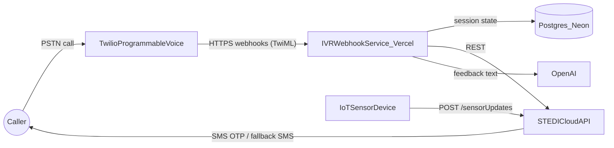

# TDD — STEDI Voice (IVR)

| Field           | Value                                                        |
| --------------- | ------------------------------------------------------------ |
| Tech Lead       | @Jared                                                       |
| Product Manager | TBD                                                          |
| Team            | Group 1                                                      |
| Epic/Ticket     | TBD                                                          |
| Source PRD      | [PRD-stedi-voice-ivr.md](./PRD-stedi-voice-ivr.md)           |
| STEDI API Docs  | [https://dev.stedi.me/openapi-ui/](https://dev.stedi.me/openapi-ui/) |
| Status          | Draft                                                        |
| Created         | 2026-07-02                                                   |
| Last Updated    | 2026-07-02                                                   |

---

## 1. Context

STEDI helps users monitor their fall risk by performing a balance and mobility test (a rapid step test) using an IoT sensor device. Today, the test is driven by a mobile app: the user authenticates via SMS, navigates the app, starts the exercise, and views the resulting balance index score on screen. The sensor data is processed by the existing STEDI cloud API ([dev.stedi.me](https://dev.stedi.me/openapi-ui/)), which stores step tests and computes a risk/balance score.

**STEDI Voice** adds a second, hands-free channel to this system: an automated phone assistant (IVR). A user calls a designated phone number, authenticates entirely over the phone (SMS one-time code plus name and date of birth), is verbally guided through the balance test while their IoT device streams sensor data to the STEDI cloud, and hears their balance index score announced with personalized feedback — all in a single call, with no smartphone app.

**Domain**: Health monitoring / fall-risk assessment. The score delivered over the call is health-related data, which raises the bar for authentication and data handling.

**Stakeholders**: Elderly users and users with physical or technical limitations (primary), STEDI product and clinical stakeholders (score parity and trust), the engineering team (Group 1) building and operating the prototype.

This TDD selects the concrete technology stack the PRD deferred ("Specific technologies and vendors will be decided later") and defines the architecture, contracts, and delivery plan for the prototype.

## 2. Problem Statement & Motivation

### Problems We're Solving

- **App dependency excludes the primary user base**: Elderly users and users with physical limitations struggle with SMS-link authentication, app navigation, and manually starting the exercise. Every step of the current flow assumes visual, touch-based interaction.
  - Impact: Reduced accessibility and adoption; the users who most need regular balance testing are the least able to complete it.
- **High interaction friction lowers testing frequency**: Even capable users face device compatibility issues, app updates, and connectivity problems.
  - Impact: Missed or abandoned tests, less longitudinal data, weaker fall-risk monitoring.
- **No non-visual channel exists**: There is currently no way to complete the test without a smartphone screen.
  - Impact: The product cannot serve voice-first or low-tech users at all.

### Why Now?

- The STEDI cloud API already exposes everything the voice channel needs (2FA, birth-date verification, sensor update polling, step-test submission, risk scoring) — the IVR is an integration project, not a platform build.
- Telephony platforms (Twilio) and serverless hosting (Vercel) make an IVR prototype achievable within a course-project timeline.
- The PRD's milestone 1 ("Stack selection") is the immediate blocker for prototype development.

### Impact of NOT Solving

- **Users**: The most at-risk population remains excluded from regular balance testing.
- **Business/Product**: Accessibility and adoption goals in the PRD are unmet; the app remains a single point of friction.
- **Technical**: No pressure-tested second channel means the cloud API's channel-independence is never validated.

## 3. Scope

### In Scope (V1 — Prototype)

- Inbound call handling on a single designated Twilio phone number with an automated greeting (FR-1.1).
- Caller authentication fully within the call: SMS one-time code (entered via keypad) plus patient name and date of birth verification (FR-2.1–FR-2.4).
- Verbal step-by-step guidance through the balance test, paced for elderly users (FR-1.2, FR-3.1).
- Phone-to-sensor connection verification before the exercise, by polling recent device updates from the STEDI API (FR-3.3).
- Sensor data collection during the exercise via the STEDI cloud pipeline; the device streams continuously and the IVR observes updates (FR-3.2, FR-3.4).
- Step-test submission and balance index score retrieval from the STEDI API, announced during the same call (FR-4.1, FR-4.2).
- Personalized verbal feedback generated by OpenAI from the score (FR-4.3).
- Failure handling: retry prompts, and SMS fallback delivery of the score if scoring times out (FR-4.4).
- Call-drop recovery: a caller can call back and resume or restart their session (FR-1.3).

### Out of Scope (V1)

- Replacing or deprecating the mobile app.
- Exercises other than the balance and mobility (rapid step) test.
- Smart-speaker integrations (Alexa, Google Home).
- Multilingual support (English only in the prototype).
- Voice-recognition (speaker identification) authentication.
- A free-form conversational AI agent (see Alternatives Considered — deliberate decision for V1).
- New device firmware or changes to the IoT device's data path.
- Outbound (system-initiated) calls.

### Future Considerations (V2+)

- Conversational voice agent (Twilio ConversationRelay or OpenAI Realtime) for natural dialogue.
- Our own message queue (Vercel Queues) for asynchronous processing if the polling model hits its limits.
- Multilingual prompts; WhatsApp OTP delivery (the STEDI API already supports it).
- Scheduled reminder calls/SMS to prompt regular testing.

## 4. Technical Solution

### Technology Stack (Decision)

| Concern | Choice | Rationale |
| --- | --- | --- |
| Telephony / IVR | Twilio Programmable Voice with classic TwiML (`<Say>`, `<Gather>`, `<Pause>`, `<Redirect>`) | Deterministic, low-latency prompts suit elderly users; webhook model fits serverless hosting; DTMF keypad entry is the most reliable input for OTP and dates |
| Text-to-speech | Amazon Polly neural voices via Twilio `<Say>` | Clear, natural, configurable pacing; no extra vendor |
| Compute / Hosting | Next.js 16 App Router route handlers on Vercel (Fluid Compute), in this repository | Team's existing stack; Twilio webhooks map directly to route handlers; instant rollback |
| AI | OpenAI (via Vercel AI SDK / AI Gateway), server-side only | Generates short personalized feedback from the score and history; kept out of the real-time audio path so it cannot stall the call |
| Session state | Postgres (Neon via Vercel Marketplace) | Twilio webhooks are stateless; a durable `call_session` row enables call-drop resume (FR-1.3) and auth attempt limiting (FR-2.4) |
| Exercise data & scoring | Existing STEDI cloud API (dev.stedi.me) | Already provides 2FA, birth-date verification, device update polling, step-test storage, and risk scoring — guarantees score parity with the app channel |
| Eventing / queue | STEDI's existing event pipeline + webhook-driven state transitions | The PRD's "Messaging Queue" component is satisfied by STEDI's own pipeline for the prototype; no additional queue infrastructure needed for V1 |

### Architecture Overview

**Key Components**:

- **Twilio Programmable Voice**: Answers the designated number, converts our TwiML responses to speech, collects keypad input, and reports call lifecycle events.
- **IVR Webhook Service (this repo, on Vercel)**: Stateless Next.js route handlers under `/api/voice/*` that receive Twilio webhooks, advance the call state machine, call the STEDI API, and return TwiML.
- **Call Session Store (Postgres/Neon)**: One row per call session holding auth progress, the STEDI session token, exercise stage, and attempt counters.
- **STEDI Cloud API**: Source of truth for customers, 2FA, device sensor updates, step tests, and risk scores.
- **IoT Device**: Streams sensor updates continuously to the STEDI cloud (`/sensorUpdates`); the IVR never talks to the device directly.
- **OpenAI**: Turns the numeric score into one or two sentences of plain-language, personalized feedback.



### Call Flow (State Machine)

The call is a linear state machine persisted in Postgres: `GREETING → AUTH_OTP_SENT → AUTH_OTP_VERIFIED → AUTH_IDENTITY_VERIFIED → DEVICE_CHECK → EXERCISE_IN_PROGRESS → SCORING → SCORE_ANNOUNCED → DONE` (plus `FAILED_AUTH` and `SCORE_PENDING_SMS` terminal states). Each Twilio webhook loads the session by Call SID (or by caller phone number for resume), performs one transition, and responds with TwiML.

```mermaid
sequenceDiagram
    participant C as Caller
    participant T as Twilio
    participant V as IVRService_Vercel
    participant P as Postgres
    participant S as STEDIAPI
    participant O as OpenAI

    C->>T: Dials STEDI Voice number
    T->>V: POST /api/voice/incoming
    V->>P: Create or resume call_session
    V->>S: GET /customer/{phone}
    V->>S: POST /twofactorlogin/{phone} (send OTP)
    V-->>T: TwiML greeting + Gather OTP digits
    C->>T: Enters OTP on keypad
    T->>V: POST /api/voice/auth/otp
    V->>S: POST /twofactorlogin (verify OTP)
    S-->>V: Session token
    V-->>T: TwiML Gather date of birth
    C->>T: Enters DOB (MMDDYYYY)
    T->>V: POST /api/voice/auth/identity
    V->>S: POST /birthdateverify/{phone}
    V->>P: Store token, mark authenticated
    V-->>T: TwiML confirm name + device check prompt
    T->>V: POST /api/voice/exercise/device-check
    V->>S: GET /devices/updates/recent
    V-->>T: TwiML exercise instructions
    Note over C,S: Device streams sensor data to STEDI while caller exercises
    loop Poll until test complete or timeout
        T->>V: POST /api/voice/exercise/poll (via Redirect/Pause)
        V->>S: GET /devices/updates/recent
    end
    V->>S: POST /rapidsteptest (save steps)
    V->>S: GET /riskscore/{email}
    V->>O: Generate feedback from score
    V-->>T: TwiML announce score + feedback
    T-->>C: Score spoken; call ends
```

**Timeout path (FR-4.4)**: If scoring is not available within the polling budget (~60–90 seconds), the IVR tells the caller their score will be sent by text message, marks the session `SCORE_PENDING_SMS`, and delivers the score via the STEDI `POST /sendtext` endpoint once available (retried by a short-lived background poll or on the next inbound webhook).

**Call-drop recovery (FR-1.3)**: Call status callbacks mark sessions interrupted. When the same phone number calls back within the session TTL (30 minutes), the IVR offers to resume from the last completed stage (skipping re-authentication if a valid STEDI token is stored) or restart.

### IVR Webhook Endpoints (this service)

All endpoints receive `application/x-www-form-urlencoded` Twilio webhook payloads (CallSid, From, Digits, etc.), validate the Twilio signature, and respond with TwiML (`text/xml`).

| Endpoint | Trigger | Responsibility |
| --- | --- | --- |
| `POST /api/voice/incoming` | Twilio: incoming call | Greet caller; create or resume session; look up customer by phone; send OTP; prompt for OTP |
| `POST /api/voice/auth/otp` | Gather: OTP digits | Verify OTP with STEDI; on failure re-prompt (max 3 attempts); on success prompt for date of birth |
| `POST /api/voice/auth/identity` | Gather: DOB digits | Verify birth date with STEDI; confirm patient name verbally; store session token; proceed to device check |
| `POST /api/voice/exercise/device-check` | Redirect | Poll recent device updates to confirm the sensor is connected; ask caller to verbally confirm readiness |
| `POST /api/voice/exercise/start` | Gather: confirmation | Deliver paced exercise instructions; start the polling loop |
| `POST /api/voice/exercise/poll` | Redirect + Pause loop | Poll device updates; detect test completion; reassure caller ("please keep going / please hold") |
| `POST /api/voice/score` | Redirect | Submit step test; fetch risk score; generate OpenAI feedback; announce score; SMS fallback on timeout |
| `POST /api/voice/status-callback` | Twilio: call status events | Mark sessions interrupted/completed; trigger SMS fallback for dropped calls after scoring |

### STEDI API Contract Summary (external dependency)

All authenticated calls send the `suresteps.session.token` header. Base URL: `https://dev.stedi.me`.

| Endpoint | Method | Used for | PRD requirement |
| --- | --- | --- | --- |
| `/customer/{phone}` | GET | Identify the customer record from the caller ID | FR-2.2 |
| `/twofactorlogin/{phoneNumber}` | POST | Send SMS OTP to caller | FR-2.1 |
| `/twofactorlogin` | POST | Exchange phone + OTP for a session token | FR-2.1 |
| `/birthdateverify/{phoneNumber}` | POST | Verify DOB (MMDDYYYY) and obtain/confirm session token | FR-2.2 |
| `/devices/updates/recent?seconds=N` | GET | Verify device connection; observe sensor updates during the exercise | FR-3.2, FR-3.3, FR-3.4 |
| `/rapidsteptest` | POST | Save the completed step test (customer, timings, stepPoints, deviceId) | FR-4.1 |
| `/riskscore/{email}` | GET | Retrieve the balance index / risk score to announce | FR-4.2 |
| `/sendtext` | POST | SMS fallback delivery of the score | FR-4.4 |

**Example — OTP verification**:

```json
// POST https://dev.stedi.me/twofactorlogin
{
  "phoneNumber": "8017190908",
  "oneTimePassword": 8936
}

// 200 OK → session token (UUID string)
"e16b6030-433d-4287-ac1b-df500851e8da"
```

### Data Model (Call Session Store)

**New table: `call_session`** (the only persistence this service owns — all health data stays in the STEDI cloud):

| Field | Type | Notes |
| --- | --- | --- |
| `id` | uuid, PK | Session identifier |
| `twilio_call_sid` | varchar, unique | Current/most recent Twilio call for this session |
| `phone_number` | varchar, indexed | Caller ID (E.164); used for resume lookup |
| `customer_email` | varchar, nullable | From STEDI customer lookup; needed for `/rapidsteptest` and `/riskscore` |
| `stedi_session_token` | varchar, nullable | STEDI token; treated as a secret, never logged |
| `state` | varchar | State machine value (see Call Flow) |
| `auth_attempts` | smallint | Failed OTP/DOB attempts; lockout at 3 (FR-2.4) |
| `device_id` | varchar, nullable | From the user profile `deviceNickName` (open question #3) |
| `exercise_started_at` / `exercise_completed_at` | timestamptz, nullable | Timing for `/rapidsteptest` payload and latency metrics |
| `score` | varchar, nullable | Cached score for SMS fallback |
| `created_at` / `updated_at` / `expires_at` | timestamptz | Sessions expire 30 minutes after creation |

**Retention**: Rows are purged after 24 hours. The STEDI session token is cleared as soon as the session reaches a terminal state.

### Configuration (Vercel environment variables)

- `TWILIO_ACCOUNT_SID`, `TWILIO_AUTH_TOKEN` (webhook signature validation)
- `STEDI_API_BASE_URL`, `STEDI_SERVICE_USERNAME`, `STEDI_SERVICE_PASSWORD` (service login for the customer lookup before the caller has their own token, if required)
- `OPENAI_API_KEY` (or Vercel AI Gateway key)
- `DATABASE_URL` (Neon Postgres)

## 5. Risks

| Risk | Impact | Probability | Mitigation |
| --- | --- | --- | --- |
| IoT device not streaming when the exercise starts (unreliable device-to-cloud path) | High — test cannot complete | Medium | Pre-exercise device check via `/devices/updates/recent`; verbal confirmation from the caller; retry prompt with guidance ("make sure your device is powered on"); graceful exit with SMS follow-up |
| Score latency exceeds what a caller will wait on the line | High — hang-ups, failed completions | Medium | "Please hold" prompts during polling; hard timeout at ~90s with SMS fallback via `/sendtext` (FR-4.4) |
| OTP SMS delayed or not delivered | High — caller cannot authenticate | Medium | Re-send option via keypad; DOB verification path; attempt limit with a polite failure message (FR-2.4) |
| Webhook latency (cold start + STEDI API round trip) causes dead air | Medium — confusing silence for elderly callers | Medium | Fluid Compute minimizes cold starts; keep STEDI calls out of latency-critical webhooks where possible; use `<Pause>`/filler prompts before slow operations |
| Spoofed webhook requests hitting `/api/voice/*` | High — unauthorized access to auth flow and PHI | Low | Validate the `X-Twilio-Signature` header on every request; reject unsigned requests; no data returned without a valid authenticated session |
| `/riskscore` response shape undocumented in the OpenAPI spec | Medium — parsing/announcement logic blocked | High | Resolve during Phase 0 by exercising the dev API with a test account (Open Question #1) |
| Caller-ID mismatch (user calls from a different phone than their profile) | Medium — customer lookup fails | Medium | Fall back to asking the caller to enter their registered phone number on the keypad |
| Score inconsistency between IVR and app channels | High — erodes trust | Low | Same STEDI scoring endpoint as the app; beta validation comparing channels (PRD success metric) |
| Scope creep toward a conversational agent | Medium — timeline blowout | Medium | V1 locked to deterministic TwiML; conversational agent explicitly deferred (Alternatives Considered) |

## 6. Security Considerations

This system authenticates users and announces health-related data over the phone; security is mandatory.

### Authentication & Authorization

- **Caller authentication (three factors before any health data is spoken)**: possession of the registered phone (SMS OTP via STEDI `/twofactorlogin`), knowledge of date of birth (`/birthdateverify`), and verbal confirmation of the patient name (FR-2.1, FR-2.2).
- **Attempt limiting (FR-2.4)**: Maximum 3 failed OTP or DOB attempts per session; on lockout the call ends with a neutral message that does not reveal which factor failed, and the session is marked `FAILED_AUTH`.
- **Authorization**: The IVR only ever acts on behalf of the authenticated caller, using their own STEDI session token. It never uses an elevated credential to read another customer's data.
- **Webhook authentication**: Every `/api/voice/*` request is verified against the `X-Twilio-Signature` header using the Twilio auth token; requests that fail validation are rejected.

### Data Protection

- **In transit**: TLS for all legs we control (Twilio → Vercel, Vercel → STEDI, Vercel → OpenAI, Vercel → Neon).
- **At rest**: Neon Postgres encryption at rest; the `call_session` table stores no health data — only auth state, the short-lived STEDI token, and timing metadata.
- **Secrets**: All keys in Vercel environment variables; never in the repository; STEDI session tokens cleared at session end and rows purged within 24 hours.
- **PII/PHI handling**: The balance score and step data live only in the STEDI cloud. The score passes through the IVR transiently for announcement and SMS fallback. OpenAI receives only the numeric score and coarse context (no name, phone, or DOB); zero-data-retention routing via Vercel AI Gateway where available.

### Logging Rules

- Never log: OTP codes, dates of birth, STEDI session tokens, full phone numbers (mask to last 4 digits), scores tied to identifiers.
- Do log: call SID, session state transitions, STEDI API status codes and latencies, error categories.

### Compliance Posture

- Health-adjacent data over a voice channel: identity verification before disclosure (implemented via the three-factor flow above) is the core control, matching the PRD's resolved privacy decision.
- Twilio and Vercel are used in their standard configurations for this prototype; a HIPAA-eligible configuration (BAAs, Twilio HIPAA-eligible products) is flagged as a prerequisite for any production launch beyond the course prototype.

## 7. Testing Strategy

| Test Type | Scope | Approach |
| --- | --- | --- |
| Unit tests | Call state machine transitions, TwiML generation, STEDI client request/response mapping, input validation (OTP digits, DOB format) | Vitest/Jest with mocked STEDI responses |
| Integration tests | `/api/voice/*` handlers end-to-end against a mocked STEDI API and simulated Twilio payloads (including invalid signatures) | Route-handler tests with a test database |
| Contract checks | STEDI API responses match expectations from the OpenAPI spec (especially `/riskscore`) | Recorded fixtures from the dev API refreshed manually |
| End-to-end call tests | Real phone call through the full happy path and key failure paths on the dev STEDI environment | Manual test script executed by the team before each milestone |

**Critical scenarios**:

- Happy path: call → OTP → DOB → device check → exercise → score announced.
- Wrong OTP ×3 → locked out with neutral message; session marked failed.
- Wrong DOB → re-prompt, then lockout.
- Unknown caller ID → keypad phone-number entry fallback.
- Device silent during device check → retry guidance, then graceful exit.
- Scoring timeout → SMS fallback message sent, call ends politely.
- Call drop mid-exercise → call back within 30 minutes → resume offered.
- Webhook with invalid Twilio signature → rejected.

## 8. Monitoring & Observability

| Metric | Source | Alert / target |
| --- | --- | --- |
| Call completion rate (calls reaching `SCORE_ANNOUNCED`) | Session state transitions in Postgres | PRD success metric; investigate if < 70% during beta |
| Authentication success rate | Session states `FAILED_AUTH` vs authenticated | Investigate if failures > 30% |
| Time from call start to score announcement | Session timestamps | PRD latency metric; target < 5 minutes end-to-end |
| Webhook latency (p95) | Vercel observability | > 2s sustained → investigate (dead-air risk) |
| STEDI API error rate / latency per endpoint | Structured logs | > 5% errors in 5 min → alert |
| Twilio call quality and drops | Twilio Voice Insights console | Reviewed during beta |
| SMS fallback rate | Sessions ending `SCORE_PENDING_SMS` | Rising rate signals pipeline latency problems |

**Structured logging**: JSON logs from the route handlers with call SID, state transition, external call latencies, and error category — following the logging rules in Security (no PHI, masked phone numbers).

**Dashboards**: Vercel observability for service health; a simple SQL/Neon dashboard over `call_session` for the funnel (greeting → auth → exercise → score), which directly reports the PRD's success metrics.

## 9. Rollback Plan

### Deployment Strategy

- Deploy to a Vercel preview environment first; point a separate Twilio test number at the preview URL for end-to-end call testing.
- Production = the main Twilio number pointed at the production Vercel deployment. Beta rollout is naturally gated by who is given the phone number.

### Rollback Triggers

| Trigger | Action |
| --- | --- |
| Webhook error rate > 5% or callers reporting dead air | Roll back Vercel deployment to previous version (instant) |
| Authentication flow broken (OTP or DOB verification failing systematically) | Roll back deployment; if STEDI-side, repoint the Twilio number to a static "temporarily unavailable" TwiML Bin |
| Suspected data exposure or auth bypass | Immediately repoint the Twilio number to the static unavailable message; investigate before restoring |
| Database migration failure | Do not proceed; restore schema via down migration; sessions are ephemeral so data loss is acceptable |

### Rollback Steps

1. **Service rollback (< 2 minutes)**: Promote the previous production deployment in Vercel.
2. **Channel kill switch (< 2 minutes)**: Repoint the Twilio number's voice webhook to a static TwiML message ("STEDI Voice is temporarily unavailable, please use the mobile app") — this fully detaches the service without touching any deployment.
3. **Communication**: Notify the team channel and the course/product stakeholders; record the incident and schedule a retro.

Because the service owns no durable health data, rollback never requires data recovery — the STEDI cloud remains the source of truth.

## 10. Implementation Plan

| Phase | Task | Description | Owner | Status | Estimate |
| --- | --- | --- | --- | --- | --- |
| **Phase 0 — Setup** | Accounts & credentials | Twilio number, Neon database, OpenAI key, STEDI dev test account; verify `/riskscore` response shape (Open Question #1) | @Jared | TODO | 2d |
| **Phase 1 — Call skeleton** | Incoming call + state machine | `/api/voice/incoming`, `call_session` table, greeting, Twilio signature validation, status callbacks | TBD | TODO | 3d |
| **Phase 2 — Authentication** | OTP + identity flow | OTP send/verify, DOB verification, name confirmation, attempt limiting, unknown-caller fallback | TBD | TODO | 4d |
| **Phase 3 — Exercise** | Device check + guided test | Device connection polling, paced instructions, exercise polling loop, completion detection | TBD | TODO | 4d |
| **Phase 4 — Scoring & feedback** | Score + OpenAI + fallback | Step-test submission, score retrieval, OpenAI feedback generation, SMS fallback, call-drop resume | TBD | TODO | 3d |
| **Phase 5 — Hardening & beta** | Tests, monitoring, beta | Test suite, logging/dashboard, end-to-end call script, beta with small user group, channel-parity validation | Team | TODO | 4d |

**Total estimate**: ~20 working days (~4 weeks). Phases are sequential; Phase 2 depends on STEDI dev-environment access from Phase 0.

## 11. Alternatives Considered

| Option | Pros | Cons | Decision |
| --- | --- | --- | --- |
| **Classic TwiML IVR + OpenAI for feedback text (chosen)** | Deterministic, predictable prompts (critical for elderly users); pure webhook model fits Vercel; cheapest; simplest to test | Less natural dialogue; keypad-driven input | **Chosen** — best fit for the user base, the hosting platform, and the timeline |
| Twilio ConversationRelay + OpenAI LLM | Natural conversation; Twilio handles STT/TTS | Requires a persistent WebSocket server, which Vercel functions cannot host — adds an always-on service (Fly/Railway) and operational complexity; non-determinism is a liability for a guided medical test | Deferred to V2 |
| OpenAI Realtime API via Twilio Media Streams | Most natural voice experience | Same WebSocket-hosting problem plus raw audio handling; highest cost and complexity | Deferred |
| Upstash Redis for session state | Serverless-native, TTL semantics match call sessions | Team chose Postgres for durability and easy funnel queries; Neon integrates via Vercel Marketplace | Postgres (Neon) chosen |
| Voice-recognition (speaker ID) authentication | Fully hands-free auth | Explicitly out of scope in the PRD; accuracy and enrollment burden | Rejected per PRD |
| Own message queue (Vercel Queues) for sensor processing | Decouples processing; PRD mentions a queue component | STEDI's existing pipeline already handles sensor ingestion; a queue adds infrastructure without a V1 need | Deferred to V2 if polling proves insufficient |

## 12. Dependencies

| Dependency | Type | Status | Risk |
| --- | --- | --- | --- |
| STEDI cloud API (dev.stedi.me) | External | Live dev environment | Medium — `/riskscore` schema undocumented; dev environment stability unknown |
| Twilio Programmable Voice + phone number | External | Needs account + number purchase | Low |
| OpenAI API (via Vercel AI SDK / Gateway) | External | Needs key | Low — not in the critical call path |
| Neon Postgres (Vercel Marketplace) | Infrastructure | Needs provisioning | Low |
| STEDI test account with registered phone + paired IoT device | External / team | Needed for all end-to-end testing | High — blocks Phases 2–5 if unavailable |
| IoT device streaming to `/sensorUpdates` | External | Assumed working (device streams continuously) | Medium — outside our control |

## 13. Glossary

| Term | Description |
| --- | --- |
| **IVR** | Interactive Voice Response — automated phone system driven by voice prompts and keypad input |
| **TwiML** | Twilio Markup Language — XML instructions telling Twilio what to do on a call (speak, gather digits, pause, redirect) |
| **DTMF** | Dual-Tone Multi-Frequency — keypad tones used for entering digits during a call |
| **Balance index / risk score** | The mobility score computed by the STEDI cloud from a rapid step test |
| **Rapid step test** | The balance and mobility exercise: a timed set of steps measured by the IoT sensor |
| **Session token** | UUID issued by the STEDI API (`suresteps.session.token` header) authorizing API calls for one user |
| **OTP / 2FA** | One-time password sent by SMS; second authentication factor |
| **Call SID** | Twilio's unique identifier for a phone call |
| **Fluid Compute** | Vercel's serverless compute model with instance reuse and low cold-start latency |

## 14. Open Questions

| # | Question | Context | Owner | Status |
| --- | --- | --- | --- | --- |
| 1 | What is the exact response shape of `GET /riskscore/{email}`? | The OpenAPI spec declares a 200 but no body schema; the announcement and feedback logic depend on it | @Jared | Open — resolve in Phase 0 against the dev API |
| 2 | How does the IoT device begin streaming — always on, or user-initiated? | Decision for V1: device streams continuously and the IVR polls; needs confirmation with the device team for the beta script | @Jared | Open |
| 3 | Where does `deviceId` for `/rapidsteptest` come from? | Likely the user profile `deviceNickName` (per `/user/{username}`), but the linkage should be confirmed | TBD | Open |
| 4 | Does the customer lookup (`GET /customer/{phone}`) require a service-level session token before the caller has authenticated? | Determines whether we need a service account login at the start of each call | TBD | Open |
| 5 | Step-point extraction: does the IVR need to compute `stepPoints` from raw sensor updates, or does STEDI derive them server-side? | Affects how much processing `/api/voice/score` must do before calling `/rapidsteptest` | TBD | Open |

## 15. Success Metrics (from PRD)

| Metric | Definition | Measurement |
| --- | --- | --- |
| User adoption | % of existing users using the IVR channel | STEDI usage data + call volume |
| Completion rate | % of calls completing the test end-to-end | `call_session` funnel (state = `SCORE_ANNOUNCED` / total sessions) |
| Latency | Average time from call start to score announcement | `call_session` timestamps |
| Accuracy | Consistency of IVR scores vs app scores | Beta users perform both channels; compare STEDI step history |
